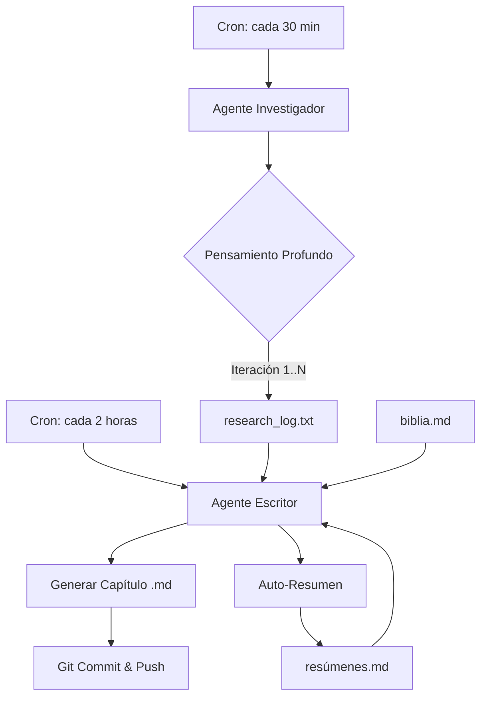

# Documentación Técnica: Proyecto "A.I. Novel Studio" (Estudio Autónomo v1.1)

## 1. Visión General del Proyecto
"A.I. Novel Studio" es un sistema de generación automatizada de literatura (Novelas Ligeras, Webnovels) impulsado por modelos de Inteligencia Artificial. Está diseñado para operar de forma **100% autónoma** utilizando **GitHub Actions** como orquestador.

A diferencia de generadores simples, este sistema utiliza un flujo de **Pensamiento Profundo (Deep Research)** y **Memoria Evolutiva** para garantizar que la trama no se pierda y que cada capítulo sea el resultado de múltiples iteraciones de planificación.

## 2. Arquitectura de Agentes y Memoria

El sistema implementa un bucle de retroalimentación constante:



### Componentes Clave:
*   **Investigador (Deep Thinker):** Realiza múltiples llamadas consecutivas a la IA para refinar una idea antes de darla por buena. Configurable mediante `researcher_calls_per_run`.
*   **Escritor (Synthesizer):** Mezcla la Biblia del mundo, las notas de investigación y la memoria de capítulos anteriores.
*   **Memoria (Long-term Context):** Sistema de auto-resúmenes almacenados en `data/resúmenes.md` que permite a la IA "recordar" hilos de trama sin saturar el contexto.

---

## 3. Configuración del Sistema (`data/config.json`)

El archivo `config.json` es el cerebro del estudio. Permite ajustar la "personalidad" de la novela sin tocar el código.

```json
{
    "system_settings": {
        "api_provider": "minimax",
        "model_name": "MiniMax-M2.7",
        "researcher_calls_per_run": 5,
        "api_key_env": "AI_API_KEY",
        "temperature_research": 0.8,
        "temperature_writing": 0.65
    },
    "story_status": {
        "title": "Crónicas del Instituto Estelar",
        "last_chapter_number": 1
    },
    "genre_weights": {
        "action": 25,
        "rom_com": 40,
        "sci_fi": 15
    }
}
```
*   **researcher_calls_per_run**: Controla cuántas veces "piensa" el investigador cada 30 minutos.
*   **api_key_env**: Nombre de la variable de entorno que contiene la clave (ej. `AI_API_KEY`).

---

## 4. Lógica de Robustez (`src/utils.py`)

El motor incluye **Exponential Backoff Retry**. Si la API falla por saturación el sistema reintenta la llamada automáticamente hasta 3 veces con esperas de 2s, 4s y 8s.

---

## 5. Automatización en GitHub Actions

El sistema se despliega mediante dos archivos `.yml` en `.github/workflows/`:

1.  **cron_researcher.yml**: Lluvia de ideas y planificación (cada 30 min).
2.  **cron_writer.yml**: Redacción de capítulo, auto-resumen y publicación (cada 2 horas).

### Requisitos de Seguridad en GitHub:
1.  **Secrets**: Crear `AI_API_KEY` en `Settings > Secrets > Actions`.
2.  **Permisos**: En `Settings > Actions > General`, activar **"Read and write permissions"** (crucial para que el bot pueda guardar los capítulos).

---

## 6. Instrucciones para el Autor (Humano)

*   **Cambiar el rumbo**: Edita `current_research_focus` en el config.
*   **Corregir el Lore**: Edita `biblia.md`. Los cambios serán absorbidos en la siguiente ejecución.
*   **Forzar un evento**: Añade una nota manualmente en `research_log.txt`. El escritor la encontrará y la integrará.

---
*Documentación generada por Antigravity AI para el proyecto AI Novel Studio (2026).*
